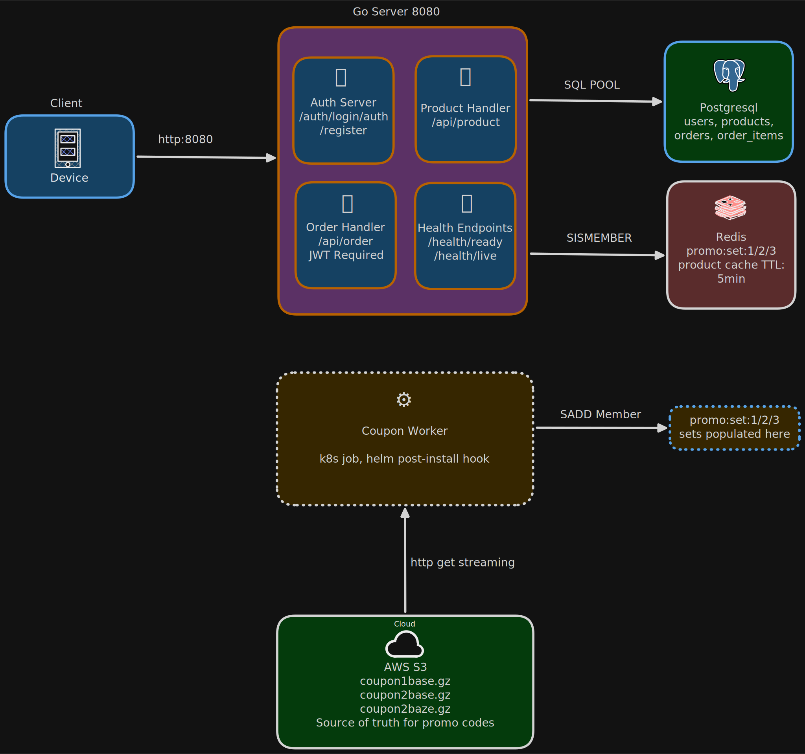

# Backend

Go API server. Serves the REST API and the React frontend.

## Architecture



Link: https://excalidraw.com/#json=uTPccQF36TKR8VRrq-j3k,p_YG2DBs7cl3glE6qnwUjQ

## Run locally

Make sure Postgres is running on `localhost:5432` and create a database:

```bash
createdb foodordering
```

Then start the server:

```bash
export PORT=8080
export DATABASE_URL="postgres://localhost:5432/foodordering?sslmode=disable"
export JWT_SECRET="any-secret"
export REDIS_URL="localhost:6379"

go run ./cmd/server
```

Server starts on `http://localhost:8080`. Migrations and seed data run automatically on first start.

## Load promo codes into Redis (one-time)

```bash
export REDIS_URL="localhost:6379"

go run ./cmd/coupon-worker
```

Downloads the 3 coupon gz files from S3 and loads them into Redis. Takes a couple of minutes. Once done, a `promo:ready` key is set in Redis.

## Build Docker image

The backend image needs the frontend image built first (it copies the static files from it):

```bash
docker build -t food-ordering-frontend:v1.0.0 ../food-ordering-frontend

docker build \
  --build-arg FRONTEND_IMAGE=food-ordering-frontend:v1.0.0 \
  -t food-ordering:v1.0.0 .
```

## Deploy a code change to a running kind cluster

```bash
docker build -t food-ordering-frontend:v1.0.0 ../food-ordering-frontend
docker build --build-arg FRONTEND_IMAGE=food-ordering-frontend:v1.0.0 -t food-ordering:v1.0.0 .

kind load docker-image food-ordering:v1.0.0 --name food-ordering

kubectl rollout restart deployment/food-ordering -n food-ordering
kubectl rollout status deployment/food-ordering -n food-ordering
```
